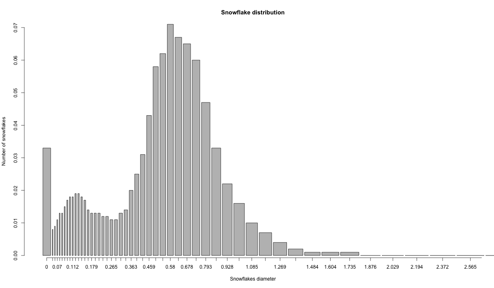
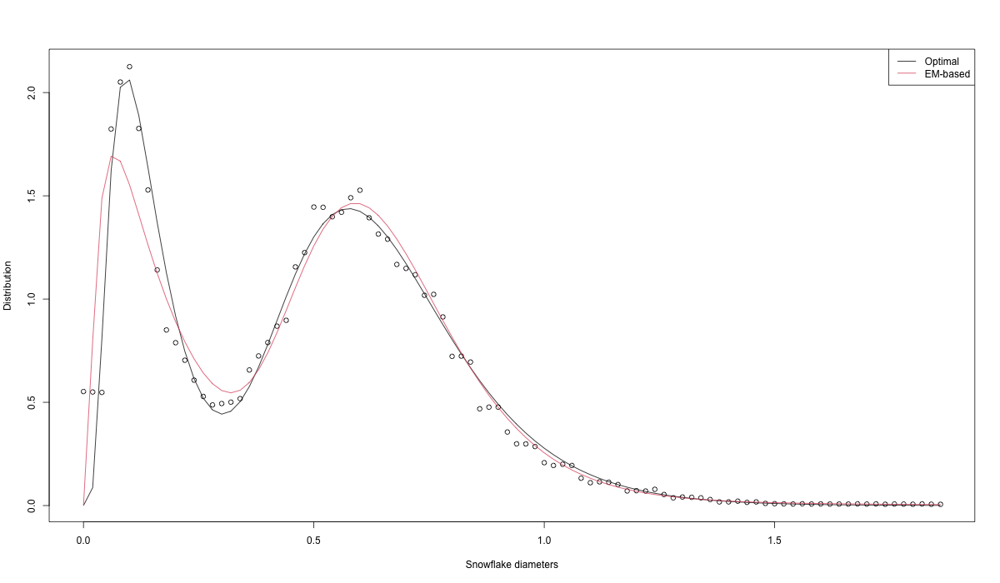

```{r setup, include=FALSE}
knitr::opts_chunk$set(echo = TRUE)
library(readr)
library(knitr)
```

## 1. Introduction

In this project, we try to find the distribution of snowflakes' diameters given a binned dataset. After discussion with an expert, a good candidate for the distribution is a mixture of two log-normal distributions. namely, $f_X(x) = (1-\tau) f_{log}(\mu_1,\sigma_1^2)(x)+\tau f_{log}(\mu_2,\sigma_2^2)(x)$ where $$f_{log}(\mu,\sigma^2)(x) = \frac{1}{x \sigma \sqrt{2\pi}}\exp\left(-\frac{(ln(x)-\mu)^2}{2}\right)$$, the lognormal probability density function.

The project can be divided in three sections. The first one is a description of the dataset and first explorations of it (namely an histogram) to assess wether the bi-lognormal model makes sense with the given dataset. Then, the second part of the project is related to the estimation of the distribution's parameters, namely $\mu_{1,2}, \sigma_{1,2}$ and $\tau$ via the EM algorithm and an optimization step described afterwards. Lastly, we check whether the diameters really come from a bi-lognormal distribution by using parametric bootstrapping methods.

## 2. Description and exploration of the dataset

The given dataset contains the total number of particles measured (variable particles.detected) and the fraction (variable retained [%]) of particles belonging to each diameter bin (given by startpoint and endpoint). However, only binned data are available (and the grid is not equidistant) which might complicate the following calculations. 

```{r,echo=FALSE,message=FALSE}
snow_particles <- read_csv("1_snow_particles.csv")
kable(snow_particles[1:5,])
```

The snowflake distribution can be represented via the following "histogram" where the bin's width are proportional to the intervals of the studied diameters
```{r,echo=FALSE,message=FALSE,fig.align="center",out.width = "65%", fig.cap = "Snowflake empirical distribution per bin"} 
 
``` 

As seen in this figure, we observe two "bumps" which might be interpreted as the mean of both log-normal distributions. One can also note that as no diameter is negative, opting for a log-normal instead of a Gaussian distribution makes more sense with respect to the given data. One can also note that the first spike between $0$ and $0.06$ is not considered as a "bump" as its width is way bigger than others and might classify too small snowflakes diameters.

## 3. Parameters estimation

First, in order to get an array-like dataset for the EM-algorithm, one can jitter the initial binned dataset by computing the rounded number of observations per bin and then uniformly sample from the start to endpoints for each bin in the dataset. This dataset called $X_j$ afterwards, will be seen as a "ground-truth" dataset for the next section.

After jittering the dataset, one can now apply the EM-Algorithm by assuming a bi-lognormal distribution. The algorithm is described below, following the notations from [Notes 07: EM | Mixing proportions - T. Masak](https://htmlpreview.github.io/?https://github.com/TMasak/StatComp/blob/master/Notes/07_EM.html#example-2-mixing-proportions):

  * Initialize first guesses for $\mu_{1,2}, \sigma_{1,2}$ and $\tau$. From the above distribution plot, we chose $\hat{\mu}_1^0 = -2,\hat{\mu}_2^0 = 0.1, \hat{\sigma}_1^0 = 0.3, \hat{\sigma}_2^0 = 0.5$ and $\hat{\tau}^0 = 0.6$.
  * Compute $\gamma_0 = \frac{f_{log}(X_j,\hat{\mu}_2^0,\hat{\sigma}_2^0)*\hat{\tau}^0}{f_X(X_j,hat{\mu}_1^0,\hat{\mu}_2^0,\hat{\sigma}_1^0,\hat{\sigma}_2^0,\hat{\tau}^0)}$, set $l_0 = +\infty$
  * Compute the observed log-likelihood $l = \sum_{i=1}^N \log \left((1-\hat{\tau}^0)f_{log}(X_j^i,\hat{\mu}_1^0,\hat{\sigma}_1^0)+ \hat{\tau}^0f_{log}(X_j^i,\hat{\mu}_2^0,\hat{\sigma}_2^0)\right)$
  * **while $||l_{old}-l||>0.01$**
  * Compute the new estimators and likelihood value
  $$\hat{\tau} = \frac{1}{N}\sum_{i=1}^N \gamma_i, \quad \hat{\mu}_1 = \frac{\sum_{i=1}^N((1-\gamma_i)\log(X_j))}{\sum_{i=1}^N(1-\gamma_i)}, \quad \hat{\mu}_2 = \frac{\sum_{i=1}^N(\gamma_i log(X_j^i))}{\sum_{i=1}^N \gamma_i}$$, 
  $$\hat{\sigma}_1 = \sqrt{\frac{\sum_{i=1}^N((1-\gamma_i)(log(X_j^i)-\hat{\mu}_1)^2)}{\sum_{i=1}^N(1-\gamma_i)}}, \quad \hat{\sigma}_2 =  \sqrt{\frac{\sum_{i=1}^N(\gamma_i(log(X_j^i)-\hat{\mu}_2)^2))^2)}{\sum_{i=1}^N\gamma_i}}$$ 
  $$\gamma = \frac{f_{log}(X_j,\hat{\mu}_2,\hat{\sigma}_2)*\hat{\tau}}{f_X(X_j,hat{\mu}_1,\hat{\mu}_2,\hat{\sigma}_1,\hat{\sigma}_2,\hat{\tau})} \quad l_{old} = l, \quad l = \sum_{i=1}^N \log \left((1-\hat{\tau})f_{log}(X_j^i,\hat{\mu}_1,\hat{\sigma}_1)+ \hat{\tau}f_{log}(X_j^i,\hat{\mu}_2,\hat{\sigma}_2)\right)$$
  * **end while**
  * Returns $\hat{\mu}_{1,2}, \hat{\sigma}_{1,2}$ and $\hat{\tau}$
  
which yields the estimators : $\hat{\mu}_1 = -1.771, \hat{\mu}_2 = -0.439, \hat{\sigma}_1 = 0.973, \hat{\sigma}_2 = 0.27$ and $\hat{\tau} = 0.56$.
  
Those parameters already give pretty good results, but it fits by construction the distribution of the jittered dataset, and not the one from the "real" bi-lognormal distribution of the snowflakes. Therefore, one can use those EM estimators as starting points for an optimization problem which would maximize the log-likelihood of the binned distribution, assuming bi-lognormal distribution. As seen in [Notes 13 : Bayesian Computation - T. Masak](https://htmlpreview.github.io/?https://github.com/TMasak/StatComp/blob/master/Notes/12_BayesComp.html), one can check that the probability distribution function of a binned dataset can be written as follows : 
$$f(d|\theta = (\mu_{1,2},\sigma_{1,2},\tau)) \propto \prod_{j=1}^{n_{bins}}[\Phi_{\theta}(a_j)-\Phi_{\theta}(a_{j-1})]^{b_j}$$ where $\Phi_{\theta}(x) = (1-\tau)\Phi_{log}(x,\mu_1,\sigma_1^2) + \tau\Phi_{log}(x,\mu_2,\sigma_2^2)$ is the cumulative density function of a bi-lognormal distribution of parameters $\theta$, $a_j$ is the $j$th endpoint and $b_j$ is the number of elements in the $j$th bin. Then, by maximizing the log-likelihood of this pdf, we get the following results : $$\hat{\mu}_1 = -2.02, \hat{\mu}_2 = -0.45, \hat{\sigma}_1 = 0.6, \hat{\sigma}_2 = 0.3 \text{ and }\hat{\tau} = 0.65$$ which we denote by $\hat{\theta}$.
Hereunder is thee figure representing the density approximations with the optimal and EM parameter' estimations, with respect to the jittered dataset $X_j$

```{r,echo=FALSE,message=FALSE,fig.align="center",out.width = "65%", fig.cap = "Snowflake empirical distribution per bin"} 
 
``` 

## 4. Parametric bootstrap

Finally, the last step now that we have the optimal parameters' estimators, is to test whether the diameters come from a bi-log-normal distribution. To do so, we apply the following methodology to estimate a p-value for the following hypothesis-testing :

$$H_0 = X \sim f_X, \quad H_1 = X \nsim f_X $$ where $f_X$ is defined in [1. Introduction]
* Set $B$ the number of bootstraps
* Compute $F_N$ the ECDF of $X_j$ and define $F_{\hat{\theta}}$ the cdf of a bi-lognormal distribution with parameters $\hat{\theta}$.
* Compute the statistics : $T := \sup_{x} |F_N(x) - F_{\hat{\theta}}(x)|$
* **for b = 1:B**
* Resample from $X_j$ to get $X_j^b$, an array of size $N$
* Compute initial parameters' estimators with the EM algorithm $\hat{\theta}^b$
* Bin $X_j^b$ by the initial bins from the original dataset
* Apply the optimization procedure of maximizing the log-likelihood of the new binned dataset and initial points $\hat{\theta}^b$
* Compute $F_N^b$ the ECDF of $X_j^b$ and define $F_{\hat{\theta}^b}$ the cdf of a bi-lognormal distribution with parameters $\hat{\theta}^b$.
* Compute the statistics : $T^b := \sup_{x} |F_N^b(x) - F_{\hat{\theta}^b}(x)|$ and store it
* **endfor**
* Finally, compute $\widehat{p-val} = \frac{1}{B+1}(1+\sum_{i=1}^B \mathbb{1}_{\{T<=T^b\}}$

After running this algorithm, one gets $\widehat{p-val} \approx 0.67$, which means that we cannot reject $H_0$ and confirms that the snowflakes follow a big-lognormal distribution.

## 5. Conclusion

This project has demonstrated the usage of statistical methods such as the EM Algorithm and the parametric bootstrap to be relevant for density estimation of binned data. After an optimizing step, we got good results and a nice distribution fitting. Even though this project was tackling snowflakes diameters, this technique can be generalized to other binned dataset such as population height or age brackets.
  
  
