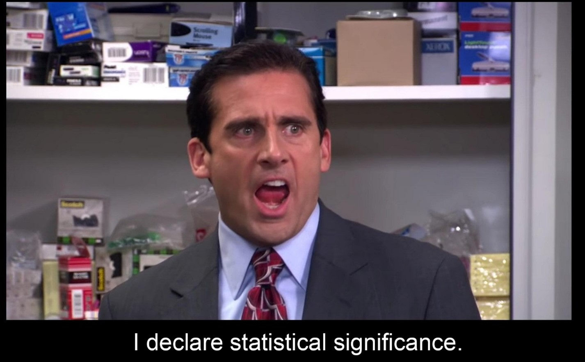

```{r setup, include=FALSE}
knitr::opts_chunk$set(echo = TRUE)
library(tidyverse)
library(car)
library(knitr)
library(kableExtra)
library(pROC)
library(flexmix)
load("2_online_shopping.RData")
```

# Introduction

During the last few decades, the usage of the internet has been tremendously important for businesses around the world. Today, and especially for younger people, the first reflex to buy anything would be to search online and buy their products from their preferred brands' websites. Those companies which sell products online therefore gather lots of data about their customers and can use it to predict their behavior and purchase habits to increase total sales. This may be done by understanding which features are the most important to predict customers' purchases. In this project, we present a way to predict customers' purchases form their activity on the website. This is done by using a logistic regression model which suits the prediction of categorical data (purchase or not) quite well when compared to other types de models such as linear regression.

In this project, we first start by exploring the given dataset, by describing its columns and by wrangling it to get better features for the prediction task. Then, we start looking at the logistic regression model creation and benchmark their performances with statistical tests such as [ANOVA](https://en.wikipedia.org/wiki/Analysis_of_variance) and other metrics like [AIC](https://en.wikipedia.org/wiki/Akaike_information_criterion), [BIC](https://en.wikipedia.org/wiki/Bayesian_information_criterion) and [AUC](https://en.wikipedia.org/wiki/Receiver_operating_characteristic). Lastly, we conclude on the obtained model and its metrics and further steps.

# Data exploration

## Dataset Description

The studied [dataset](https://archive.ics.uci.edu/ml/datasets/Online+Shoppers+Purchasing+Intention+Dataset) contains a list of customers' session on a given website with several features described below. Each of the 11630 rows represents one customer's session, ending with a purchase or not. Each session belongs to a different user in a 1-year period to avoid any tendency to a specific campaign, special day, user profile, or period.

Description of the dataset columns following by its `relabelling` for clarity purposes:

* `Administrative` : number of administrative-type pages that the user visited - `n_admin_page`
* `Administrative_Duration` : time spent on administrative pages - `time_admin_page`
* `Informational` : number of informational-type pages visited - `n_info_page`
* `Informational_Duration` : time spent on informational-type pages - `time_info_page`
* `ProductRelated` : number of product-related-type pages visited - `n_product_page`
* `ProductRelated_Duration` : time spent on product-related-type pages - `time_product_page`
* `BounceRates` : average bounce rate of pages visited (for a specific webpage, the bounce rate is the percentage of users who enter the webpage and then leave without triggering any other requests during their sessions) - `bounce_rates`
* `ExitRates` : average exit rate of pages visited (for a specific webpage, the exit rate is the proportion of page views to the page that were the last in the session) - `exit_rates`
* `PageValues` : average page value of pages visited (for a specific webpage, the page value gives an idea of how much each page contributes to the site’ revenue) - `page_values`
* `SpecialDay` : value in $[0,1]$ indicating closeness of the session to a special day (e.g. Mother’s day, etc.) taking into account delivery, etc. (e.g. special_day $> 0$ from Feb $2$ reaching value $1$ on Feb $12$) - `special_day`
* `Month` : which month the session took place - `month`
* `OperatingSystems` : operating systems of the users coded as integers - `os`
* `Browser` : type of web browser of the users coded as integers - `browser`
* `Region` : geographic region in which the user is located coded as integers - `region`
* `TrafficType` : where from the user arrived at the site (e.g. ad banner, SMS link, direct URL, etc.) coded as integers - `traffic_type`
* `VisitorType` : type of visitor (either Returning, New or Other type of visitor) - `visitor_type`
* `Weekend` : binary indicator of whether the session took place during a weekend - `weekend`
* `Revenue` : the response variable, 0/1 indicating whether a purchase was made or not - `purchase`

## Dataset transformations

First, one can plot histograms for each of the column of the dataset and therefore observe their respective distributions. As seen in Fig $1.$, some features can be seen as factors and should therefore be mutated in the dataset by using the `as.factor` command. We list as factor the following list of columns : `month`,`os`,`browser`,`region`,`traffic_type`,`visitor_type`,`weekend`and `purchase`.
 
```{r, echo=FALSE, message=FALSE, fig.height=6,fig.width=12,fig.align='center',warning=FALSE}
names(Data) <- c("n_admin_page","time_admin_page","n_info_page",
                 "time_info_page","n_product_page","time_product_page",
                 "bounce_rates","exit_rates","page_values","special_day",
                 "month","os","browser","region","traffic_type","visitor_type",
                 "weekend","purchase")

factors <- 11:18
# Factored data
Data <- Data %>% mutate(os=as.factor(os), browser=as.factor(browser),
                        region=as.factor(region),weekend = as.factor(weekend),
                        traffic_type=as.factor(traffic_type),
                        purchase=as.factor(purchase),month=as.factor(month),
                        visitor_type=as.factor(visitor_type))

Data %>% mutate_if(is.factor,as.numeric) %>% pivot_longer(everything()) %>% 
  ggplot(aes(value)) + geom_histogram(aes(y=..density..)) + 
  labs(title = "Distribution of features", 
       caption="Fig 1 : Distribution of each feature of the dataset",
       y = "Distribution", x = "feature value") + 
       theme(axis.text=element_text(size=13),
             axis.title=element_text(size=15,face="bold"),
             title= element_text(size=20,face="bold"),
       plot.caption = element_text(size=15)) +
       facet_wrap(~ name, scales = "free")

# Merging the factored data
for (i in factors){
  count_table <- table(Data[,i])
  Data[,i] <- fct_collapse(Data[,i],other=names(count_table[count_table<50]))
}
```

Secondly, for each of those categorical columns, the factors with less than $50$ observation are merged into a "other" factor to reduce the number of factors and indirectly the number of dummy variables for each category in the following sections. 

As seen in Fig. $1$, the time spent on a given type of page, i.e. product, admin or info has a few high values, especially the time spent on product-related page. In order to avoid those large ranges of values which might harm the prediction result due to different order of magnitudes, one can either think about a log-transformation, i.e. $x \mapsto \log(1+x)$ to take care of zero values and decrease the range of values or on the other hand, transform those time-related columns to average time spent per number of pages of each category. In this project, the second option was used to avoid applying some trick such as the log transforms on time and keep intuition about the column used in the model. We therefore replace the columns `time_admin_page`,`time_info_page` and `time_product_page` by `avg_time_admin_page`,`avg_time_info_page` and `avg_time_product_page`. As seen in Fig. $2$, values which were of order $0-10^5$ become of order $0-10^3$ for the time spent on product-related for example, which is already more reasonable.

```{r, echo=FALSE,message=FALSE,fig.align='center',fig.height=4,fig.width=8,warning=FALSE}
quotient_prod <- rep(0, nrow(Data)) # initialize the quotient vector
zero_denom_prod <- which(Data[, "n_product_page"] == 0) # find indices where denominator is 0
quotient_prod[-zero_denom_prod] <- Data[, "time_product_page"][-zero_denom_prod]/Data[, "n_product_page"][-zero_denom_prod]

quotient_info <- rep(0, nrow(Data)) # initialize the quotient vector
zero_denom_info <- which(Data[, "n_info_page"] == 0) # find indices where denominator is 0
quotient_info[-zero_denom_info] <- Data[, "time_info_page"][-zero_denom_info]/Data[, "n_info_page"][-zero_denom_info]

quotient_admin <- rep(0, nrow(Data)) # initialize the quotient vector
zero_denom_admin <- which(Data[, "n_admin_page"] == 0) # find indices where denominator is 0
quotient_admin[-zero_denom_admin] <- Data[, "time_admin_page"][-zero_denom_admin]/Data[, "n_admin_page"][-zero_denom_admin]

Data <- Data %>% select(-time_product_page,-time_admin_page,-time_info_page) %>% 
  mutate(avg_time_product_page = quotient_prod,avg_time_admin_page = quotient_admin,avg_time_info_page = quotient_info)

 Data %>% select(avg_time_product_page,avg_time_admin_page,avg_time_info_page) %>% 
   pivot_longer(everything()) %>% ggplot(aes(value)) + 
   geom_histogram(aes(y = ..density..)) + 
   labs(title = "Distribution of avg. time features", 
        caption="Fig 2 : Distribution of time features of the dataset",
        y = "Distribution", x = "feature value") + theme(axis.text=element_text(size=12),
        axis.title=element_text(size=10,face="bold"),title= element_text(size=15,face="bold"),
        plot.caption = element_text(size=12)) + facet_wrap(~ name, scales = "free")
```

# Logisitic regression model creation

As discussed in [Introduction], we will try to fit a logistic regression model to the given dataset and get meaningful categorical predictions depending on a given probability threshold for a purchase on the website.

## Finding the statistically relevant variables

First, we start with a basic logistic regression model using every possible covariate (variable in the dataset) called $glm_0$. We then use the ANOVA of type $2$ with a Loglikelihood Ratio Test to assess whether a certain covariate is statistically significant. More precisely, the ANOVA is a statistical process for analyzing the amount of variance that is contributed to a sample by different variables. One can see the type II as the comparison of the model from which we would remove one variable at a time and the saturated model. Then, by examining the marginal contribution of a given covariate, one can assess its statistical significance regarding the target's prediction.

```{r, echo=FALSE,message=FALSE,warning=FALSE}
AUC_eval <- function(gmodel,Data){
  set.seed(517)
  Folds <- matrix(sample(1:dim(Data)[1]), ncol=5)
  AUC <- rep(0,5)
  for(k in 1:5){
    train <- Data[-Folds[,k],]
    test <- Data[Folds[,k],]
    my_gm <- glm(gmodel$formula, family="binomial", data=train)
    test_pred <- predict(my_gm, newdata = test, type="response")
    AUC[k] <- auc(test$purchase,test_pred)
}
  return(mean(AUC))
}

glm0 <- glm(purchase~., data=Data,family = "binomial")
Anova(glm0,type=2,test="LR") %>% 
  kable(digit=3,caption = "ANOVA Test-II Table for original model") %>% 
  kable_styling()

#cat(AUC_eval(glm0,Data)) # 0.8844597
#AIC(glm0) # 7171.662
#BIC(glm0) # 7583.897
```
As seen from the results of the ANOVA II-test on $glm_0$, we observe a few statistically significant covariates (p-value less than $0.1$): `n_product_page`,`exit_rates`,`page_values`,`month`,`traffic_type`,`visitor_type`,`avg_time_product_page`. From this full model, we get an AUC of $0.884$ which is below the targeted benchmark of $0.895$. For the sake of completeness, we get an AIC of $7172$ and a BIC of $7584$.

The next step is to fit the model containing only the statistically significant covariates, which we will call $glm_{sig}$. With this model, we obtain an AUC of $0.8878$, an AIC of $7145$ and a BIC of $7344$. All those metrics are slightly better than $glm_0$, even though the model-submodel test using the Loglikelihood ratio test has a p-value of $0.35$, as seen on the two tables below.

```{r, echo=FALSE, message=FALSE,warning=FALSE}
glm_sig <- glm(purchase ~ n_product_page + exit_rates + page_values + month + traffic_type + visitor_type + avg_time_product_page, data=Data,family = "binomial")
Anova(glm_sig,type=2,test="LR") %>% kable(digit=3,caption = "ANOVA Test-II Table for $glm_{sig}$") %>% kable_styling()

# everything is significant (as expected)
#AUC_eval(glm_sig,Data)) # 0.8878329
#AIC(glm_sig) # 7145.045
#BIC(glm_sig) # 7343.802
anova(glm0,glm_sig,test="LRT") %>% kable(digit=3,caption = "Model-submodel test between $glm_0$ and $glm_{sig}$") %>% kable_styling()
```

## Deeper look at the residuals

Now that we have a basic logistic regression model $glm_{sig}$, one can plot the residuals vs the covariates and assess whether there are non-linear relations which might have been missed and could contribute to better target prediction.

```{r, echo=FALSE,message=FALSE,fig.height=6,fig.width=12,fig.align='center',warning=FALSE}
Data %>% mutate_if(is.factor,as.numeric) %>%
  mutate(res=resid(glm_sig)) %>%
  pivot_longer(-res) %>% ggplot(aes(y=res,x=value)) + 
  labs(title = "Residuals vs Covariate plot", 
       caption="Fig 3 : Residuals points and smoothing function wrt. covariate values",
       y = "Residuals", x = "Covariate value")+ 
  theme(axis.text=element_text(size=12),
        axis.title=element_text(size=10,face="bold"),
        title= element_text(size=15,face="bold"),
        plot.caption = element_text(size=12))+ 
  facet_wrap(~ name, scales = "free") + geom_point() + geom_smooth()

```

A few comments can be made on those residual plots. First, the most obvious non-linear relation is the non-linear relation of the residuals with respect to `page_values`. After a few tests, we have seen that a cubic function sucessfully explains the residuals regarding this covariate (the quadratic relation still left non-linearities in the resulting residual plot). Even if it is very subtle, one can observe that the smoothing lines for `avg_time_product_page`,`n_product_page`,`n_admin_page` and `n_info_page` are slightly non-linear. Hereunder is the Anova type-II test regarding those.

```{r,echo=FALSE,message=FALSE,warning=FALSE}
glm_enhanced <- glm(purchase ~ n_product_page + exit_rates + page_values + month
                    + traffic_type + visitor_type + avg_time_product_page + 
                      I(page_values^2) + I(page_values^3) + I(avg_time_product_page^2)+ 
                      I(n_product_page^2)+I(n_admin_page^2)+I(n_info_page^2),
                    data=Data,family = "binomial")
#Anova(glm_enhanced,type=2,test="LR")
Anova(glm_enhanced,type=2,test="LR") %>% 
  kable(digits = 3,caption = "ANOVA Test-II Table for enhanced model") %>% 
  kable_styling()
```
With this anova test, one can see that the quadratic dependence on product- and admin-related pages are significant, while the one with respect to the average of time-product per page and the information-related page are not, with respectively a p-value of $0.16$ and $0.9$, those will therefore be discarded. Additionally, one can note that the average time per product page is the least significant from the remaining covariates, and by checking the AUC,AIC and BIC from the model with and without this covariate, one obtains better results when dropping it, which we will do.

```{r,echo=FALSE,message=FALSE,warning=FALSE}
glm_enhanced <- glm(purchase ~ n_product_page + exit_rates + page_values + month
                    + traffic_type + visitor_type+ I(page_values^2) + I(page_values^3)+
                      I(n_product_page^2)+I(n_admin_page^2),
                    data=Data,family = "binomial")
#AUC_eval(glm_enhanced,Data) # 0.9043155
#AIC(glm_enhanced) # 6514.713
#BIC(glm_enhanced) # 6735.554
anova(glm_sig,glm_enhanced,test="LRT") %>% 
  kable(digit=3,caption = "Model-submodel test between $glm_{sig} $and $glm_{en}$") %>% 
  kable_styling()
```
With this enhanced model $glm_{en}$, we get an AUC of 0.9043 which is beating the benchmark. Additionally, it has a AIC of $6515$, a BIC of $6735$ and a p-value of $0$ for the model-submodel test with $glm_{sig}$, which shows a great amelioration from the previous model by adding nonlinearities.

## Adding interactions

One can now think about interactions between covariates to find subtle relations from covariates. In this project, we focused on interactions between continuous and categorical variables.

First, we started with the interaction between the week-end boolean and the other covariates in the model. By running an ANOVA type II test, we get that the interaction with `n_product_page`,`page_values` and `visitor_type` are statistically significant.

```{r,echo=FALSE,message=FALSE,warning=FALSE}
glm_enhanced_wk <- glm(purchase ~ (n_product_page + exit_rates + page_values + month + 
                                     traffic_type + visitor_type+ I(page_values^2) + 
                                     I(page_values^3) + I(n_product_page^2)+
                                     I(n_admin_page^2))*weekend,
                       data=Data,family = "binomial")
#Anova(glm_enhanced_wk,type=2,test="LR")
```
By the same reasoning for visitor's type, we noted that the interaction with lots of covariates are statistically relevant, and especially with `page_values` related covariate (linear, quadratic and cubic). The interactions between the month and visitor type are also worth to be noted.

```{r,echo=FALSE,message=FALSE,warning=FALSE}
glm_enhanced_vt <- glm(purchase ~ (n_product_page + exit_rates + page_values + month + 
                                     traffic_type + visitor_type+ I(page_values^2) +
                                     I(page_values^3) + I(n_product_page^2)+
                                     I(n_admin_page^2))*visitor_type,
                       data=Data,family = "binomial")
#Anova(glm_enhanced_vt,type=2,test="LR")
```
However, when adding all those interactions, and running an ANOVA test as well as computing the AUC, we obtained poor results (AUC of $0.81$ and non-significance), which shows the limitations of such tests. For the final model, we chose to only keep the interactions `page_values:weekend` and `page_values:visitor_type`, as those gave better AUC results overall. All the covariates used for the final model and their respective p-value are listed below, as well as the result of the model-submodel test between $glm_{en}$ and $glm_{final}$ with p-value approx. equal to $0$. Regarding the metrics, we obtain $0.905$ for AUC, $6480$ for AIC and $6723$.


```{r,echo=FALSE,message=FALSE,warning=FALSE}
glm_final <- glm(purchase ~ n_product_page + exit_rates + page_values + month 
                            + traffic_type + visitor_type+ I(page_values^2) + 
                            I(page_values^3) + I(n_product_page^2)+I(n_admin_page^2)
                            +page_values:weekend+page_values:visitor_type,
                            data=Data,family = "binomial")

#Anova(glm_final,type=2,test="LR")

anova(glm_enhanced,glm_final,test="LRT") %>% 
  kable(digit=3,caption = "Model-submodel test between $glm_{en}$ and $glm_{final}$") %>% 
  kable_styling()

#AUC_eval(glm_final,Data) # 0.9050036
#AIC(glm_final) # 6479.966
#BIC(glm_final) # 6722.89
```
# Conclusion

To conclude, we created a logistic regression model predicting whether a customer would buy a product on an e-commerce website, attaining an AUC of $0.905$. The covariates are a combination of metrics coming from the website itself (`n_product_page`,`n_admin_page`), from the date of the session (`month`,`weekend`) and from Google Analytics (`traffic_type`,`visitor_type`,`page_values`,`exit_rates`), and non-linear transformations of certain variables. This project was heaviliy based on ANOVA testing and statistical significance to find relevant covariates, and is therefore highly depending on the type of test which was done (likelihood ratio test in this case), as well as the significance level chosen throughout the covariate selection. Finally, we added interactions in order to find more subtle relations between covariates, which resulted in an overall increase of the model's score. The next steps would be to compare this model with other types of prediction models (random forests, neural networks,...) and check its performance.

# Bonus scientific contribution

```{r, echo=FALSE,message=FALSE,fig.show="hold", out.width="50%",fig.align='center',warning=FALSE}

```
